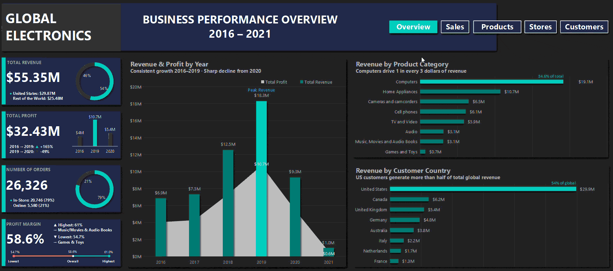

# Global Electronics Retailer — Interactive Excel Dashboard



---

## Why I Built This

After completing a static Coffee Shop Sales dashboard, I wanted to push myself further. I wanted to build something that felt less like a student project and more like something you'd actually see in a business setting — a dashboard that tells a real story, answers real questions, and works interactively without breaking the moment someone touches a filter.

So I picked up the Maven Analytics Global Electronics dataset — 62,884 transactions, 5 tables, mixed currencies, 8 countries, 5 years of data and decided to build the most complete Excel dashboard I could.

This is that dashboard.

---

## What It Covers

The dataset runs from 2016 through February 2021, covering a global electronics retailer with both physical stores and an online channel. It has everything — revenue, product costs, customer demographics, store locations, and daily exchange rates across multiple currencies.

The dashboard is split across five tabs:

- **Overview** — an executive summary with no slicers, designed to give any stakeholder a complete picture at a glance
- **Sales Performance** — revenue trends, year-over-year growth, monthly seasonality, and channel breakdown over time
- **Product Performance** — which categories, brands, and products are actually driving the business
- **Store Performance** — which countries and individual stores are leading and which are falling behind
- **Customer Demographics** — who is buying, from where, and how that customer base grew over time

---

## The Dataset

| Table | Rows | What It Contains |
|---|---|---|
| Sales | 62,885 | Every transaction — the fact table |
| Customers | 15,267 | Demographics, location, birthday |
| Products | 2,518 | Category, brand, cost, price |
| Stores | 2,211 | Country, state, size, opening date |
| Exchange Rates | 11,276 | Daily rates for all transaction currencies |

**Source:** Maven Analytics

---

## How I Approached the Data Model

Before touching a single pivot table, I mapped the full data model. Sales sits at the center as the fact table. Customers, Products, and Stores are dimension tables that join to it via foreign keys. Exchange Rates is the most technically complex join — it connects to Sales on two columns simultaneously (Order Date + Currency Code), which meant I had to use an array-based INDEX-MATCH formula rather than a simple VLOOKUP.

All financial metrics are normalized to USD using the exchange rate on the exact order date, not a monthly or annual average. This matters when you're comparing revenue across 8 countries with different currencies.

One thing I discovered that wasn't documented anywhere in the dataset was that StoreKey = 0 means Online. I caught this by noticing that every row with a missing Delivery Date had a non-zero StoreKey, while every row with a Delivery Date had StoreKey = 0. That single observation gave me a clean Online vs In-Store channel split that became one of the most important dimensions in the entire dashboard.

---

## Calculated Columns I Added

**In the Sales sheet:**
- `Exchange_Rate` — pulled via INDEX-MATCH on Date + Currency Code (array formula)
- `Revenue_USD` — Quantity × Unit Price USD × Exchange Rate
- `Cost_USD` — Quantity × Unit Cost USD × Exchange Rate
- `Profit_USD` — Revenue minus Cost
- `Profit_Margin_%` — Profit divided by Revenue
- `Sales_Channel` — Online if StoreKey = 0, otherwise In-Store
- `Delivery_Days` — Delivery Date minus Order Date, N/A where missing

**In the Customers sheet:**
- `Age` — calculated using DATEDIF against the dataset end date (Feb 2021), not TODAY()
- `Age_Group` — bucketed into Under 30, 30–44, 45–59, and 60+

**In the Stores sheet:**
- `Store_Age_Years` — same approach, using Feb 2021 as the reference point

Using the dataset end date instead of TODAY() was a deliberate decision. Calculating ages against the current date would make every customer appear 4–5 years older than they actually were during the period we're analyzing. Small detail, but it matters.

---

## What I Found

A few things genuinely surprised me when the data came together.

Revenue grew 167% between 2016 and 2019 — from $6.85M to $18.31M. But when I dug into how that growth happened, I found that Average Order Value actually *declined* by 16% over the same period (from $2,391 to $2,016). The growth wasn't driven by customers spending more — it was driven entirely by more customers placing more orders. That's a fundamentally different growth story than what the revenue numbers alone would suggest.

The COVID-19 impact is visible month by month in 2020. January and February were strong ($2M+), then revenue collapsed from March onwards and never recovered. December 2020 — typically the strongest month — came in 75% lower than December 2019.

On the store side, Canada stood out. With only 3 physical stores, it generates an average of $1.58M in revenue per store. France has 7 stores and averages $0.15M per store. That's a 10x efficiency gap within the same business.

The customer demographic picture was cleaner than I expected. The gender split is almost exactly 50/50, and average order value is consistent across all age groups at around $2,100. The 60+ segment dominates revenue at 38.4% — not because older customers spend more per order, but because they order far more frequently.

**Summary of key findings:**

- Revenue peaked at $18.31M in 2019 before COVID caused a 49% decline in 2020
- Computers alone drive 34.6% of total revenue
- Music, Movies & Audio Books has the highest profit margin at 61% despite ranking 7th in revenue
- US customers generate 54% of global revenue
- Online channel share grew from 16.7% to 22.5% between 2016 and 2020 — even as total revenue declined
- Average customer age is 51.7 years, with the 60+ segment as the largest revenue driver
- Canada is the most efficient store market; France is the least

---

## Dashboard Features

The dashboard is fully slicer-driven. All KPI cards reference pivot table cells directly, so they update automatically when any filter is applied. I was careful about which slicers connect to which charts — for example, the Age Group chart on the Customer tab is deliberately not connected to the Age Group slicer, because selecting a single age group would leave you with one bar and no useful information.

The Overview tab has no slicers — it's designed as a summary that always reflects the full dataset, giving any viewer a reliable anchor before they start filtering.

Navigation between tabs is handled through hyperlinked buttons in the header row, styled to highlight the current tab.

---

## Tools

Built entirely in **Microsoft Excel **. No Power BI, no Tableau, no Python for the dashboard itself, just pivot tables, slicers, XLOOKUP, INDEX-MATCH, and a lot of careful layout work.

---

## How to Use

Download `GlobalElectronics_Dashboard.xlsx` and open it in Microsoft Excel or WPS Spreadsheets. Enable editing if prompted. Use the navigation buttons at the top to move between tabs, and the slicers on each tab to filter the data. Everything updates automatically.

---

## Repository Structure

```
global-electronics-dashboard/
│
├── GlobalElectronics_Dashboard.xlsx
├── README.md
│
├── dataset/
│   ├── Customers.csv
│   ├── Sales.csv
│   ├── Products.csv
│   ├── Stores.csv
│   ├── Exchange_Rates.csv
│   └── Data_Dictionary.csv
│
├── screenshots/
│   ├── overview.png
│   ├── sales.png
│   ├── products.png
│   ├── stores.png
│   └── customers.png
│
└── demo/
    └── dashboard_demo.gif
```

---

## About Me

I recently completed my Master's in Data Science at Deakin University. This dashboard is part of my data analyst portfolio — built to demonstrate what's possible in Excel beyond basic charts and tables.

I work across Python, SQL, Tableau, and Excel. If you have feedback on this project or want to connect, I'd genuinely love to hear from you.

**Sahil Mallick**

**www.linkedin.com/in/sahil-mallick-851246200**

**sahil27032001malik@gmail.com**  

---

*Dataset courtesy of Maven Analytics — Global Electronics Retailer*
